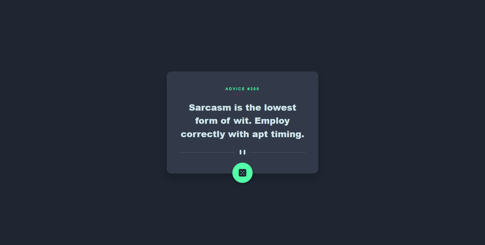

# Advice Generator App

[](https://your-live-site-url.com)

## 📝 Project Overview

The **Advice Generator App** is a simple yet elegant application that generates random advice from the [Advice Slip JSON API](https://api.adviceslip.com/). It features responsive design, interactive UI components, and animated icons for an enhanced user experience.

---

## 🚀 Features

- Fetches random advice using the Advice Slip API.
- Displays unique advice ID along with the text.
- Responsive design for desktop and mobile devices.
- Interactive "dice" button with animation and hover effects.

---

## 📸 Screenshots

### Desktop View


### Mobile View


---

## 🛠️ Built With

- **React** - Frontend framework.
- **CSS** - For styling and responsive design.
- **Advice Slip JSON API** - Provides random advice data.

---

## ⚙️ Setup & Installation

1. Clone the repository:
   ```bash
   git clone https://github.com/AxM133/advice-generator

## 👀 View the site

https://advice-generator-xi-topaz.vercel.app/
